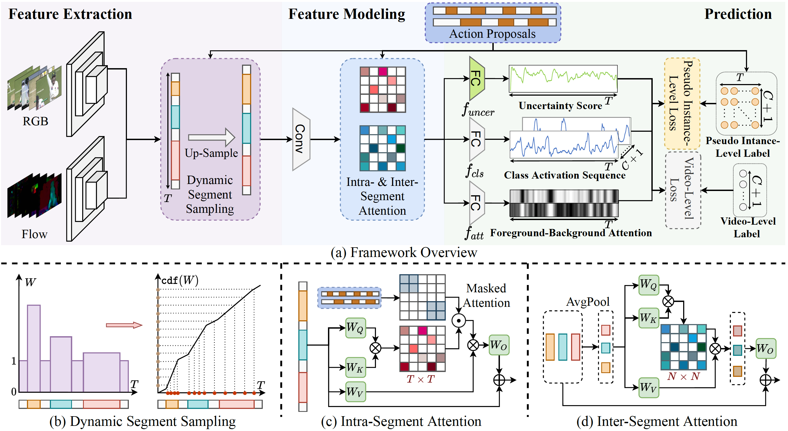

# ASM-Loc: Action-aware Segment Modeling for Weakly-Supervised Temporal Action Localization (CVPR2022)
The  official repository of our paper ["**ASM-Loc: Action-aware Segment Modeling for Weakly-Supervised Temporal Action Localization**"](https://arxiv.org/pdf/2203.15187.pdf) .



## Abstract
Weakly-supervised temporal action localization aims to recognize and localize action segments in untrimmed videos given only video-level action labels for training. Without the boundary information of action segments, existing methods mostly rely on multiple instance learning (MIL), where the predictions of unlabeled instances (i.e., video snippets) are supervised by classifying labeled bags (i.e., untrimmed videos). However, this formulation typically treats snippets in a video as independent instances, ignoring the underlying temporal structures within and across action segments.
To address this problem, we propose ASM-Loc, a novel WTAL framework that enables explicit, action-aware segment modeling beyond standard MIL-based methods. 
Our framework entails three segment-centric components: (i) dynamic segment sampling for compensating the contribution of short actions; (ii) intra- and inter-segment attention for modeling action dynamics and capturing temporal dependencies; (iii) pseudo instance-level supervision for improving action boundary prediction.
Furthermore, a multi-step refinement strategy is proposed to progressively improve action proposals along the model training process.

{:height=50% width=50%}
<!--  -->


## Requirements
Required packages are listed in `requirements.txt`. You can install by running:

```bash
pip install -r requirements.txt
```

## Dataset
We evaluate our ASM-Loc on two popular benchmark datasets THUMOS-14 and ActivityNet-1.3. 
Before running the code, please download the dataset from the link provided in [ACM-Net](https://github.com/ispc-lab/ACM-Net).
Unzip it under the `data/` folder and make sure the data structure is as below.

   ```
    ├── data
    └── THUMOS14
        ├── gt.json
        ├── split_train.txt
        ├── split_test.txt
        └── train
            ├── ...
        └── test
            ├── ...
    └── ActivityNet13
        ├── gt.json
        ├── split_train.txt
        ├── split_test.txt
        └── train
            ├── ...
        └── test
            ├── ...
   ```

## Running

### Training
```bash
# For the THUMOS-14 dataset
python main_THUMOS.py --batch_size 16

# For the ActivityNet-v1.3 dataset
python main_ActivityNet.py --batch_size 64
```

### Testing
First, download the [checkpoints](https://drive.google.com/file/d/1JofEQg3vn2oe9JiJg2WugrBBDYoehxta/view?usp=sharing) into "saved_model" directory and pass it as the checkpoint flag. 

```bash
# For the THUMOS-14 dataset
python main_THUMOS.py --batch_size 16 --test --checkpoint saved_model/THUMOS

# For the ActivityNet-v1.3 dataset
python main_ActivityNet.py --batch_size 64 --test --checkpoint saved_model/ActivityNet
```

## Results
    *  Note that the performance of checkpoints we provided is slightly different than the orignal paper! Details are as follows:

   <div align="center" id="table_result">
   <table>
   <thead>
       <tr>
           <th align="center" colspan="8">THUMOS-14, mAP@tIoU(%)</th>
       </tr>
       <tr>
           <th align="center">0.1</th>
           <th align="center">0.2</th>
           <th align="center">0.3</th>
           <th align="center">0.4</th>
           <th align="center">0.5</th>
           <th align="center">0.6</th>
           <th align="center">0.7</th>
           <th align="center">AVG</th>
       </tr>
   </thead>
   <tbody>
       <tr>
           <td align="center">71.1</td>
           <td align="center">65.4</td>
           <td align="center">57.4</td>
           <td align="center">46.7</td>
           <td align="center">36.8</td>
           <td align="center">25.5</td>
           <td align="center">14.4</td>
           <td align="center">45.3</td>
       </tr>
   </tbody>
   </table>
   </div>

<div align="center" id="table_result">
   <table>
   <thead>
       <tr>
           <th align="center" colspan="4">ActivityNet-v1.3, mAP@tIoU(%)</th>
       </tr>
       <tr>
           <th align="center">0.5</th>
           <th align="center">0.75</th>
           <th align="center">0.95</th>
           <th align="center">AVG</th>
       </tr>
   </thead>
   <tbody>
       <tr>
           <td align="center">41.0</td>
           <td align="center">24.5</td>
           <td align="center">0.6</td>
           <td align="center">25.1</td>
       </tr>
   </tbody>
   </table>
   </div>

## Citation

If you find our code or our paper useful for your research, please **[★star]** this repo and **[cite]** the following paper:

```latex
@article{he2022asm,
  title={ASM-Loc: Action-aware Segment Modeling for Weakly-Supervised Temporal Action Localization},
  author={Bo He and Xitong Yang and Le Kang and Zhiyu Cheng and Xin Zhou and Abhinav Shrivastava},
  journal={Proceedings of the IEEE/CVF Conference on Computer Vision and Pattern Recognition (CVPR)},
  year={2022}
}
```

## Acknowledgement

We referenced the repos below for the code

- [BasNet](https://github.com/Pilhyeon/BaSNet-pytorch)
- [ActivityNet](https://github.com/activitynet/ActivityNet)
- [ACM-Net](https://github.com/ispc-lab/ACM-Net)

